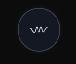
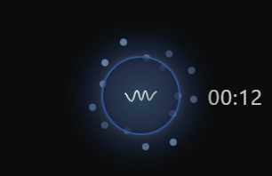
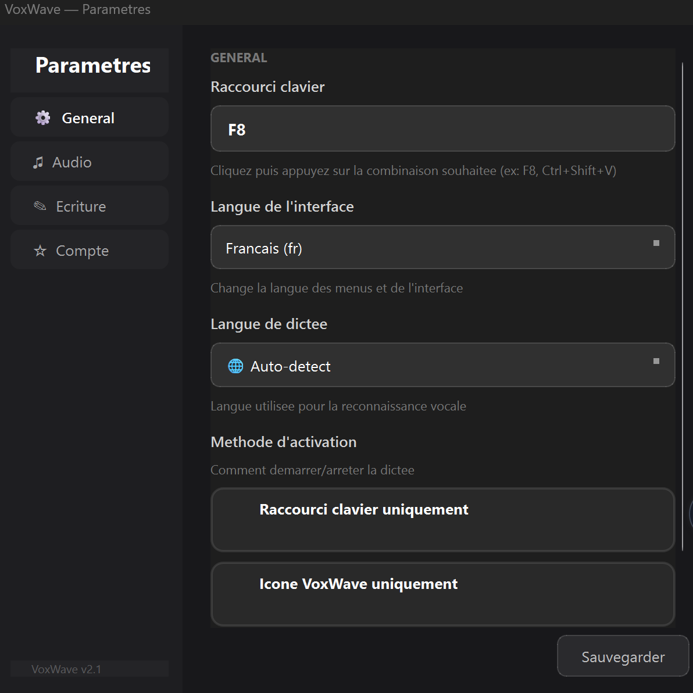

<p align="center">
  
</p>

<h1 align="center">VoxWave</h1>

<p align="center">
  <strong>Voice dictation for Windows & Linux</strong><br>
  Speak → Transcribe → Clean → Paste clean text
</p>

<p align="center">
  
  
  
  
  
</p>

<p align="center">
  <a href="#features">Features</a> •
  <a href="#installation">Installation</a> •
  <a href="#usage">Usage</a> •
  <a href="#configuration">Configuration</a> •
  <a href="#building">Building</a>
</p>

---

<p align="center">
  
  &nbsp;&nbsp;&nbsp;&nbsp;
  
</p>
<p align="center"><em>Idle &nbsp;→&nbsp; Recording</em></p>

<p align="center">
  
</p>
<p align="center"><em>Settings — custom hotkey, language, activation mode</em></p>

## Features

- **Hybrid transcription** — Groq cloud (fast) with automatic fallback to local Whisper
- **LLM cleaning** — OpenAI → Ollama → regex cascade removes filler words, fixes punctuation
- **Progressive injection** — Raw text appears in <1s, then silently replaced with cleaned version
- **15 languages** — Full interface translation (EN, FR, ES, DE, IT, PT, NL, JA, KO, ZH, RU, AR, TR, PL, SV)
- **Works offline** — Local Whisper + Ollama fallback when cloud is unavailable
- **Circuit breaker** — Automatic cloud → local failover, transparent to the user
- **Hallucination detection** — 35+ known patterns rejected before text reaches your app
- **Custom hotkey** — F8, Ctrl+Shift+V, or any combo you want
- **Modern GUI** — Floating orb widget with reactive aura, 9-page onboarding, settings sidebar

## How it works

```
Hotkey (start) → Capture audio → Hotkey (stop) → Transcribe → Clean → Paste
```

1. Press your hotkey → starts recording
2. Press again → stops, transcribes, cleans
3. Clean text is pasted into your active app

## Installation

### Download (recommended)

Download the latest release from [Releases](https://github.com/farnel94-source/voxwave-app/releases):
- **Windows**: `VoxWave-Setup.exe`
- **Linux**: `VoxWave.AppImage`

### From source

```bash
git clone https://github.com/farnel94-source/voxwave-app.git
cd voxwave-app
pip install -r requirements.txt

# Optional: install Ollama for local AI cleaning
# https://ollama.ai
ollama pull gemma3:4b
```

## Usage

```bash
# Launch the app
python -m voxwave

# With a specific Whisper model
python -m voxwave --model small

# Test microphone
python -m voxwave --test
```

## Configuration

Edit `config.yaml`:

```yaml
hotkey: F8                    # Dictation hotkey
language: en                  # Interface language
whisper:
  language: auto              # Transcription language (auto or specific)
  model: base                 # tiny / base / small / medium / large-v3
cleaning:
  mode: quality               # raw / verbatim / quality
  provider: hybrid            # hybrid / cloud / local
transcription:
  provider: hybrid            # hybrid / cloud / local
```

### Cloud mode (optional)

Create a `.env` file:

```env
GROQ_API_KEY=your_key_here
OPENAI_API_KEY=your_key_here
```

Without API keys, VoxWave runs fully local (Whisper + Ollama + regex).

## Building

```bash
# Build for your platform
python build.py build

# Build + create installer
python build.py all
```

## Tech stack

| Component | Technology |
|-----------|-----------|
| Transcription (cloud) | Groq API (whisper-large-v3-turbo) |
| Transcription (local) | faster-whisper |
| Cleaning (cloud) | OpenAI GPT-4o-mini |
| Cleaning (local) | Ollama (gemma3:4b) + regex |
| GUI | PySide6 + QWebEngineView |
| Audio | sounddevice + webrtcvad + Silero VAD |
| Hotkeys | pynput |
| Packaging | PyInstaller + Inno Setup (Win) + AppImage (Linux) |

## Development

```bash
# Run tests
pytest tests/ -v

# Format code
black src/ tests/

# Coverage
pytest tests/ --cov=src --cov-report=html
```

## Platforms

- **Windows 10+** — Full support
- **Linux** — Full support (AppImage)
- macOS — Not supported (by design)

## License

MIT
